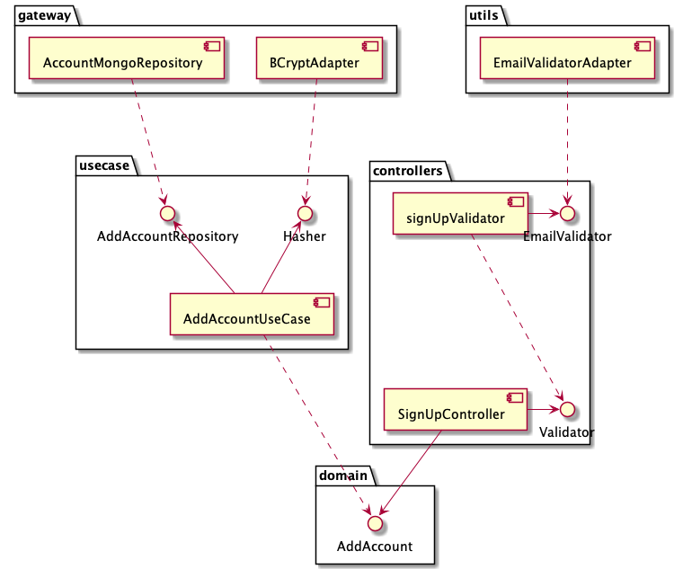

# 👩‍💻 ms-account
This project aims to handle an account, by implementing the basic operations, such as sign up, log in, and refresh-token. This is a training project.

---
## 🏛 Architecture
This project was build using Clean Architecture. Basically, the application is broken into layers, each one with its responsibility. The main layers are:

* **controllers:** It is responsible to adapt the web interface (by HTTP) into the domain model. Body validations and transformations from client to application and vice-versa should be done here.
* **domain:** It is the core of the application. The domain contains all the entities and the protocols (interfaces) to its related operations.
* **usecases:** It is the implementation of the business rules related to the operations described on **domain**.
* **gateways:** It is responsible to adapt and uncouple external access, such as databases and third-party APIs.
* **main:** It is the single hard-coupled layer responsible to build all the instances and inject the dependencies.

Following the Clean Architecture guide-lines, the most inner layers should not know the most external layers, and it is done by using the Dependency Inversion Principle (DIP). Therefore, the use case layer (for instance) should not know the gateway layer. Instead, the use case layer declares protocols that should be implemented by the gateway layer. Any class that implements that protocol is eligible to be used by use case.

The following diagram shows the dependency graph of the sign-up feature. Note the inter-layer dependency: **domain** does not depend on any layer, and **gateway** depends on **usecase** instead of the contrary.



> More diagrams can be found in `/docs`

Following Interface Segregation Principle (ISP), each interface/protocol defines a single operation. A single class can implement several interfaces if it respects the Single Responsibility Principle (SRP). For instance, BCryptAdapter implements both `Hasher` and `HashComparer` interfaces, since both are interconnected and share similar responsibilities.

---
## 🌎 Endpoints

This project exposes the following endpoints and contracts.

### signup

This endpoint aims to create a new account, given the body information. All the fields are mandatory and email must be valid. When a valid body is provided, the account is persisted and the response has code `201` and the just persisted account as the body.

`POST /signup`
```json
{
    "name": "any name",
    "email": "any@email.com",
    "password": "any password",
    "passwordConfirmation": "any password",
}
```

## login

This endpoint aims to authenticate an existent user given an email and password. Both fields are mandatory. When credentials are valid, the response has code `200` and the access and refresh tokens as the body.

`POST /login`
```json
{
    "email": "any@email.com",
    "password": "any password",
}
```

## refresh-token

The provided access token (vide [login](#login)) expires in short time-intervals, to get a new access-token without the need to authenticate again by email/password, use this endpoint.

Provide the mandatory field refresh-token (from [login](#login) or last [refresh-token](#refresh-token) request) to get a new pair of access and refresh tokens. The refresh-token will also expire but in a larger time interval.

`POST /refresh-token`
```json
{
    "refreshToken": "valid-refresh-token"
}
```

---
## 🚀 How to run

Before run, you must have a MongoDB database available to be used. Take its URL connection, it will be used later.

### ➡ from code

* Export the database connection URL to `MONGO_URL`.
* `npm start`

### ➡ from docker
* `docker --name ms-account -p 3000:3000 -e MONGO_URL=database_connection pcandido/ms-account`
